# DevGaurd — PAM Automation Portal

<p align="center">
  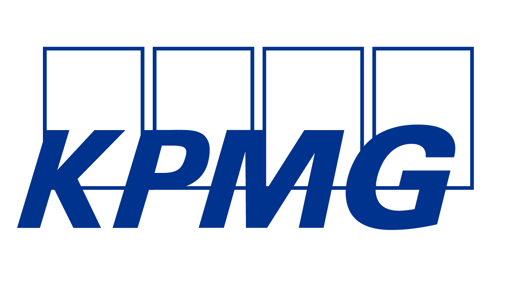
</p>

<p align="center">
  <strong>Enterprise-oriented Privileged Access Management automation for CyberArk</strong>
</p>

<p align="center">
  Automate identity, role, Safe, membership, and managed-account provisioning through a state-aware, retry-friendly and auditable workflow.
</p>

<p align="center">

[](https://nodejs.org/)
[](https://react.dev/)
[](https://www.typescriptlang.org/)
[](https://expressjs.com/)
[](https://www.mongodb.com/)
[](https://www.cyberark.com/)

</p>

<p align="center">

### 🚀 Live Application

**[DevGaurd PAM Automation Portal](https://devgaurd.vercel.app)**

</p>

---

# 📑 Table of Contents

- [About the Project](#-about-the-project)
- [Why PAM Tools Are Needed](#-why-pam-tools-are-needed)
- [Industry Problems Addressed](#-industry-problems-addressed)
- [What is DevGaurd?](#-what-is-devgaurd)
- [Key Features](#-key-features)
- [Application Screenshots](#-application-screenshots)
- [Architecture](#-architecture)
- [PAM Provisioning Workflow](#-pam-provisioning-workflow)
- [Idempotency Model](#-idempotency-model)
- [CyberArk Object Model](#-cyberark-object-model)
- [Application Architecture](#-application-architecture)
- [Authentication and Authorization](#-authentication-and-authorization)
- [Auditability and Observability](#-auditability-and-observability)
- [Tech Stack](#-tech-stack)
- [API](#-api)
- [Repository Structure](#-repository-structure)
- [Workflow Response](#-workflow-response)
- [Environment Variables](#-environment-variables)
- [Getting Started](#-getting-started)
- [Security Considerations](#-security-considerations)
- [Failure and Recovery Model](#-failure-and-recovery-model)
- [Testing Strategy](#-testing-strategy)
- [Key Components](#-key-components)
- [Key Benefits](#-key-benefits)
- [Enterprise Evolution](#-enterprise-evolution)
- [Roadmap](#-roadmap)
- [Project Context](#-project-context)
- [Author](#-author)
- [License](#-license)

---

# 📌 About the Project

**DevGaurd** is a full-stack **Privileged Access Management (PAM) Automation Portal** designed to automate and visualize CyberArk onboarding operations.

The project addresses a common enterprise security challenge: privileged access cannot be treated like ordinary application access.

In a typical enterprise environment, administrators may need to provision:

- A privileged identity
- Appropriate PAM roles
- A CyberArk Safe
- Safe memberships
- Managed accounts
- Account permissions
- Credential-management capabilities
- Reconciliation
- Audit evidence

Performing these operations manually across multiple systems can introduce delays, configuration inconsistencies and operational risk.

DevGaurd provides a centralized workflow that performs these operations through CyberArk APIs while maintaining an execution trail for operational visibility.

---

# 🔐 Why PAM Tools Are Needed

Modern enterprises manage thousands of privileged identities and accounts across:

- Windows servers
- Linux servers
- Databases
- Cloud infrastructure
- Network devices
- Service accounts
- Application accounts
- Administrative identities

Privileged accounts are particularly sensitive because they can provide elevated access to critical infrastructure.

Without a centralized PAM solution, organizations may face problems such as:

```text
Uncontrolled privileged credentials
            │
            ▼
     Shared accounts
            │
            ▼
  Excessive privileged access
            │
            ▼
   Weak accountability
            │
            ▼
 Credential exposure / misuse
            │
            ▼
 Security & compliance risk
```

A PAM platform such as **CyberArk** helps organizations centralize and control privileged identities and credentials.

However, the PAM platform itself does not eliminate operational complexity.

Large-scale environments still require administrators to perform repetitive provisioning activities:

```text
Create Identity
      │
      ▼
Assign PAM Role
      │
      ▼
Create / Locate Safe
      │
      ▼
Assign Safe Membership
      │
      ▼
Create Managed Account
      │
      ▼
Configure / Reconcile
      │
      ▼
Audit
```

This is the problem DevGaurd addresses.

---

# 🧩 Industry Problems Addressed

DevGaurd is designed around several practical enterprise PAM challenges.

| Industry Problem               | DevGaurd Approach                     |
| ------------------------------ | ------------------------------------- |
| Manual PAM onboarding          | Automated provisioning workflow       |
| Repetitive administrator tasks | API-driven orchestration              |
| Duplicate resource creation    | Check-before-create logic             |
| Difficult workflow visibility  | Step-based execution response         |
| Poor operational traceability  | MongoDB audit records                 |
| Unclear provisioning status    | Workflow progress UI                  |
| Slow troubleshooting           | Request IDs and execution metadata    |
| Multiple CyberArk operations   | Centralized onboarding workflow       |
| Repeated requests              | Retry-friendly state-aware processing |
| Lack of operational KPIs       | Audit dashboard and execution metrics |

### Traditional approach

```text
Administrator
     │
     ├── Open CyberArk
     ├── Find / Create User
     ├── Assign Role
     ├── Find / Create Safe
     ├── Add Safe Membership
     ├── Find / Create Account
     ├── Reconcile Account
     └── Document Changes
```

### DevGaurd approach

```text
Administrator
      │
      ▼
Submit Request
      │
      ▼
┌───────────────────────────┐
│         DevGaurd          │
│                           │
│ Check → Create if needed  │
│ Verify → Continue         │
│ Audit → Report            │
└─────────────┬─────────────┘
              │
              ▼
          CyberArk
              │
              ▼
       Provisioned State
```

---

# 🛡️ What is DevGaurd?

DevGaurd converts a multi-step PAM onboarding process into a single workflow.

The backend acts as an orchestration layer between the portal and CyberArk:

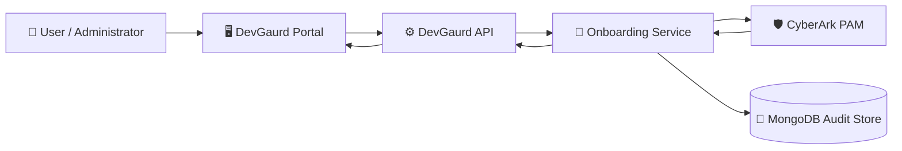

The central design principle is:

> **Determine the current state first, then perform only the required operation.**

This makes the workflow significantly safer to retry than a workflow that blindly executes create operations.

---

# ✨ Key Features

## 1. 👤 Automated User Onboarding

DevGaurd automates CyberArk user provisioning.

The workflow:

1. Checks whether the user exists.
2. Creates the user if required.
3. Verifies the resulting state.
4. Continues to the next provisioning stage.

---

## 2. 👥 Privilege Cloud Role Assignment

The workflow verifies whether the user belongs to the required CyberArk group.

If the user is not a member:

```text
Check Membership
      │
      ├── Already Member ──► Continue
      │
      └── Not Member ──────► Assign Role
```

This avoids repeatedly assigning an existing membership.

---

## 3. 🔐 Safe Provisioning

DevGaurd checks whether the requested Safe exists.

```text
             Safe Exists?
             /          \
           Yes           No
           │              │
           ▼              ▼
       Continue       Create Safe
```

Safe membership is then independently verified.

---

## 4. 💻 Managed Account Provisioning

The application checks whether the requested managed account already exists inside the target Safe.

If it does not exist, DevGaurd provisions the account and proceeds with reconciliation.

---

## 5. 🔄 Retry-Friendly / Idempotent Workflow

Repeated requests converge toward the existing CyberArk state.

Example:

```text
First Request
────────────────────────────
User            → created
Role            → assigned
Safe            → created
Membership      → added
Account         → created
Reconciliation  → completed


Repeated Request
────────────────────────────
User            → already_exists
Role            → already_member
Safe            → already_exists
Membership      → already_added
Account         → already_exists
```

The workflow therefore avoids intentionally creating duplicate CyberArk resources during normal repeated execution.

---

## 6. 📊 Audit Logs and Operational Metrics

Every completed onboarding workflow generates an audit record.

The audit dashboard provides visibility into:

- Total requests
- Successful requests
- Failed requests
- Average execution time
- Request IDs
- Workflow results
- Provisioning step statuses
- Request and completion timestamps

---

## 7. 🔐 Authentication and Authorization

DevGaurd provides:

- JWT-based authentication
- bcrypt password hashing
- Protected onboarding APIs
- Admin authorization middleware
- Separation between authentication and privileged workflow authorization

---

# 🖥️ Application Screenshots

The portal is designed to give administrators a centralized operational view of PAM provisioning.

## 📊 Dashboard

The dashboard provides the primary entry point into the DevGaurd platform.

It provides navigation to:

- Dashboard
- User Onboarding
- Audit Logs
- Access Request
- Documentation
- Workflow & Architecture
- Support

It is designed to provide administrators with a single interface rather than requiring them to manually navigate multiple PAM operations.

<p align="center">
  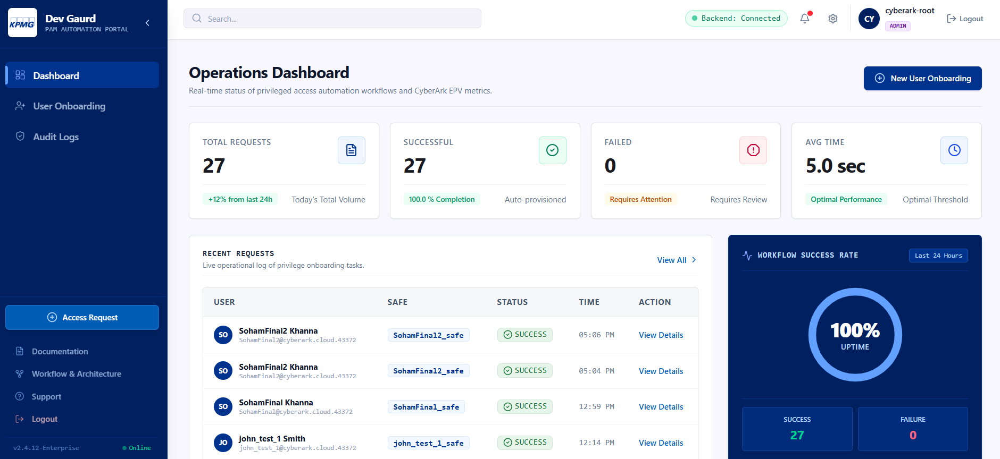
</p>

---

## 👤 User Onboarding

The User Onboarding interface allows an administrator to initiate the CyberArk provisioning workflow.

The request contains information such as:

- Username
- Email
- First name
- Last name
- Managed account information
- Platform ID
- Target address
- Optional Safe name

The frontend communicates with the backend API, while the backend handles the actual CyberArk operations.

<p align="center">
  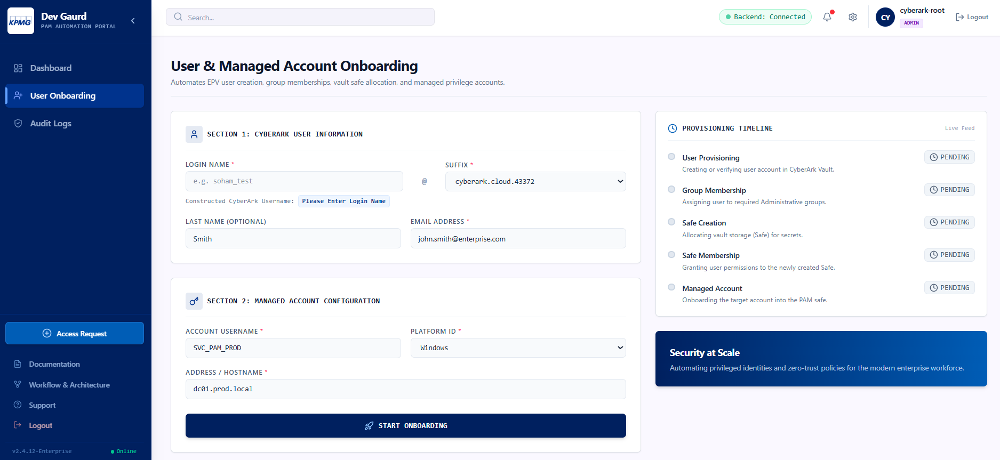
</p>

### Provisioning progress

The UI represents the backend workflow as individual execution stages:

```text
┌────────────────────────────────────┐
│ User Provisioning                  │
│          ✓ Completed               │
├────────────────────────────────────┤
│ Privilege Cloud Membership         │
│          ✓ Completed               │
├────────────────────────────────────┤
│ Safe Provisioning                  │
│          ✓ Completed               │
├────────────────────────────────────┤
│ Safe Membership                    │
│          ✓ Completed               │
├────────────────────────────────────┤
│ Managed Account                    │
│          ✓ Completed               │
├────────────────────────────────────┤
│ Reconciliation                     │
│          ✓ Completed               │
└────────────────────────────────────┘
```

This allows an administrator to understand where a workflow succeeded or failed without manually inspecting CyberArk.

---

## 📋 Workflow Result

After execution, DevGaurd displays the result of each provisioning stage.

For example:

```text
User
    already_exists

Privilege Cloud Group
    already_member

Safe
    already_exists

Safe Membership
    already_added

Managed Account
    already_exists
```

This is particularly useful when the same request is submitted again because the administrator can immediately understand that DevGaurd detected the existing state instead of recreating resources.

<p align="center">
  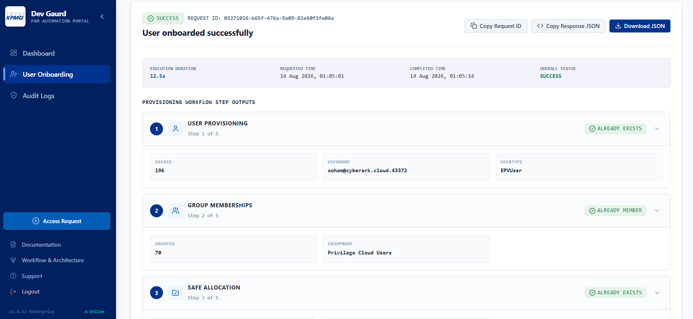
</p>

---

## 📑 Audit Logs

The Audit Logs page provides historical visibility into provisioning workflows.

It exposes operational information such as:

```text
Total Requests
Successful Requests
Failed Requests
Average Execution Time
```

Individual requests can be inspected to understand:

- What was requested
- When it was requested
- How long it took
- Which resources already existed
- Which resources were created
- Which provisioning stages completed

<p align="center">
  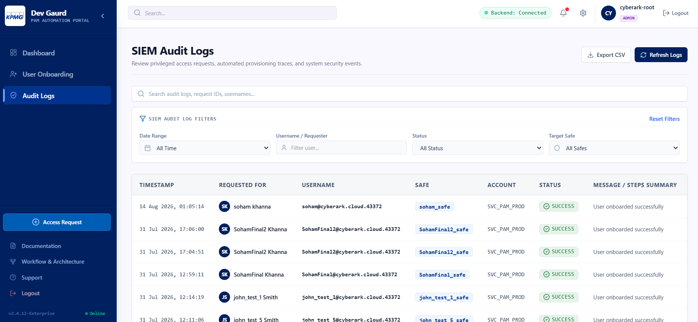
</p>

## 🔄 Workflow & Architecture

Show the application's workflow/architecture page.

<p align="center">
  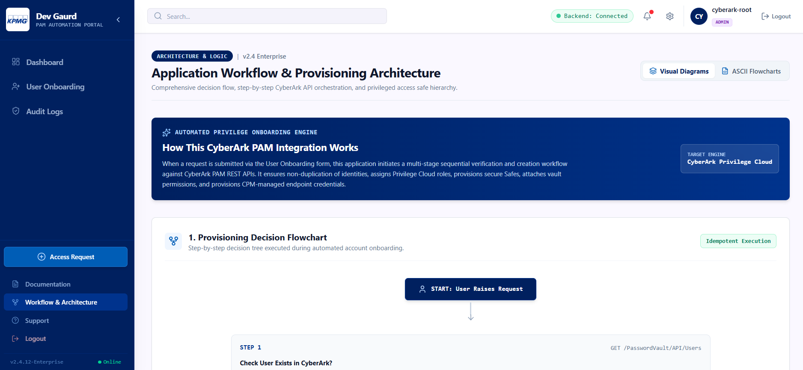
</p>

---

# 🏗️ Architecture

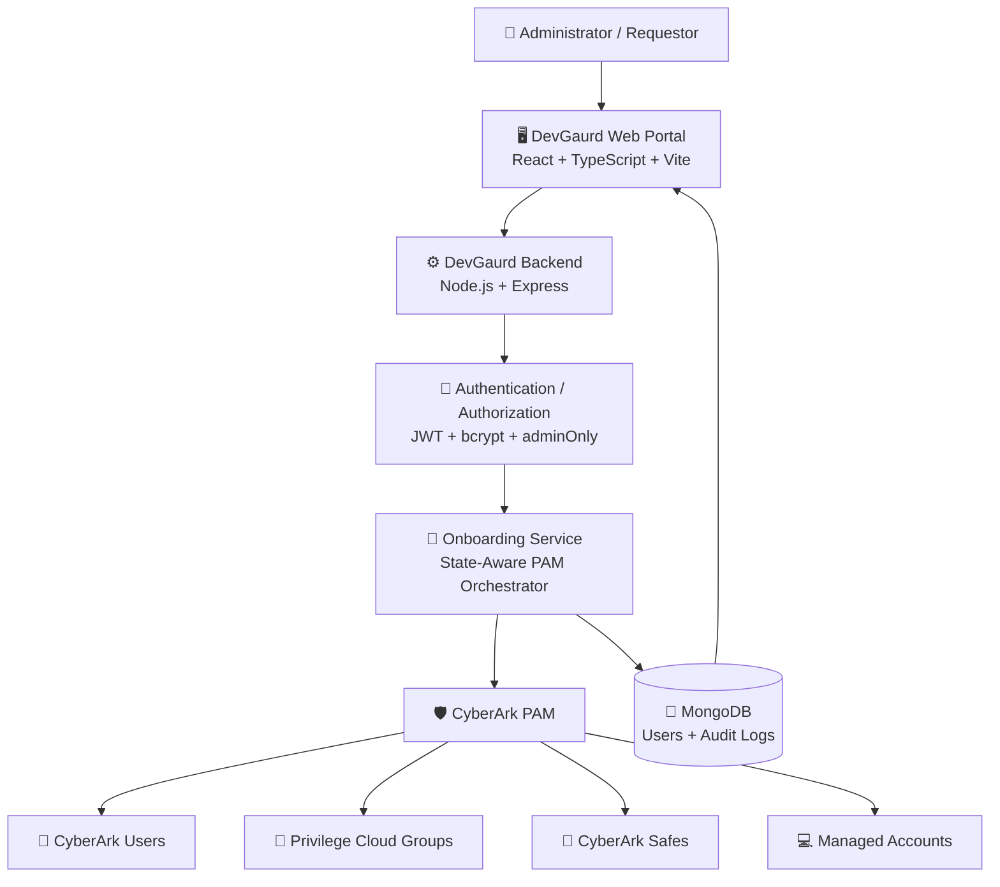

---

# 🔄 PAM Provisioning Workflow

The primary DevGaurd workflow follows a **check-before-create** architecture.

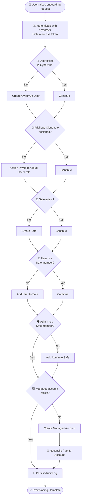

---

# 🔁 Idempotency Model

Idempotency is a core architectural principle of DevGaurd.

Instead of blindly issuing create requests:

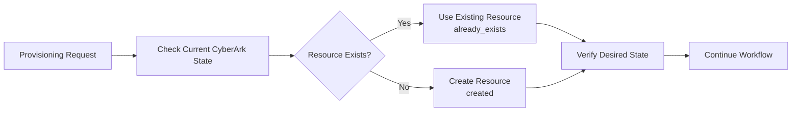

The following workflow operations implement this pattern:

| Resource                   | Implementation            |
| -------------------------- | ------------------------- |
| CyberArk User              | `checkUserExists()`       |
| Privilege Cloud Membership | `ensureGroupMembership()` |
| Safe                       | `checkSafeExists()`       |
| Safe Membership            | `isUserMemberOfSafe()`    |
| Managed Account            | `checkAccountExists()`    |
| Account Reconciliation     | `reconcileAccount()`      |

---

# 🛡️ CyberArk Object Model

DevGaurd automates relationships between CyberArk users, groups, Safes and managed accounts.

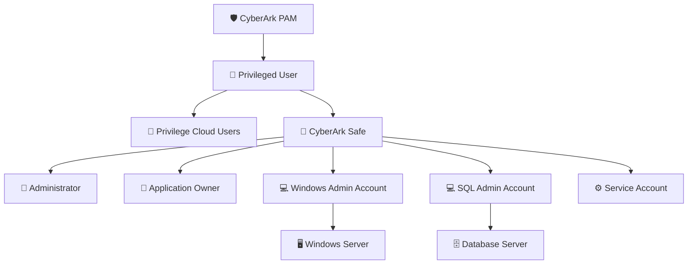

Conceptually:

```text
                         CyberArk PAM
                              │
                              ▼
                           User
                         /      \
                        /        \
                       ▼          ▼
              Privilege Role     Safe
                                  │
                    ┌─────────────┼─────────────┐
                    ▼             ▼             ▼
              Managed Account-1  Managed Account-2  Service Account
                    │             │
                    ▼             ▼
              Target System   Database / Server
```

---

# 🧩 Application Architecture

DevGaurd follows a layered backend architecture.

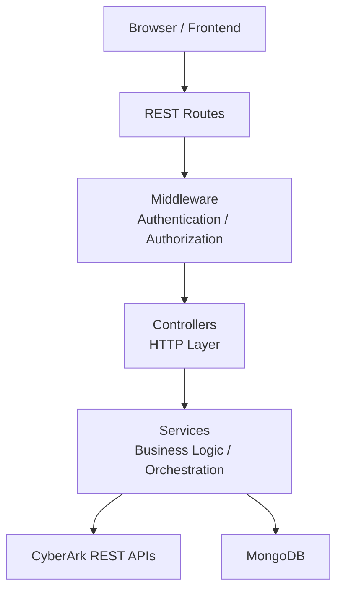

### Layer responsibilities

| Layer                | Responsibility                                |
| -------------------- | --------------------------------------------- |
| Frontend             | User interaction and workflow visualization   |
| Routes               | REST endpoint definitions                     |
| Middleware           | Authentication and authorization controls     |
| Controllers          | HTTP request/response handling                |
| Services             | PAM business logic and workflow orchestration |
| Models               | MongoDB persistence                           |
| CyberArk Integration | PAM API operations                            |
| Audit Layer          | Workflow history and operational metrics      |

---

# 🔐 Authentication & Authorization

DevGaurd separates authentication from privileged workflow authorization.

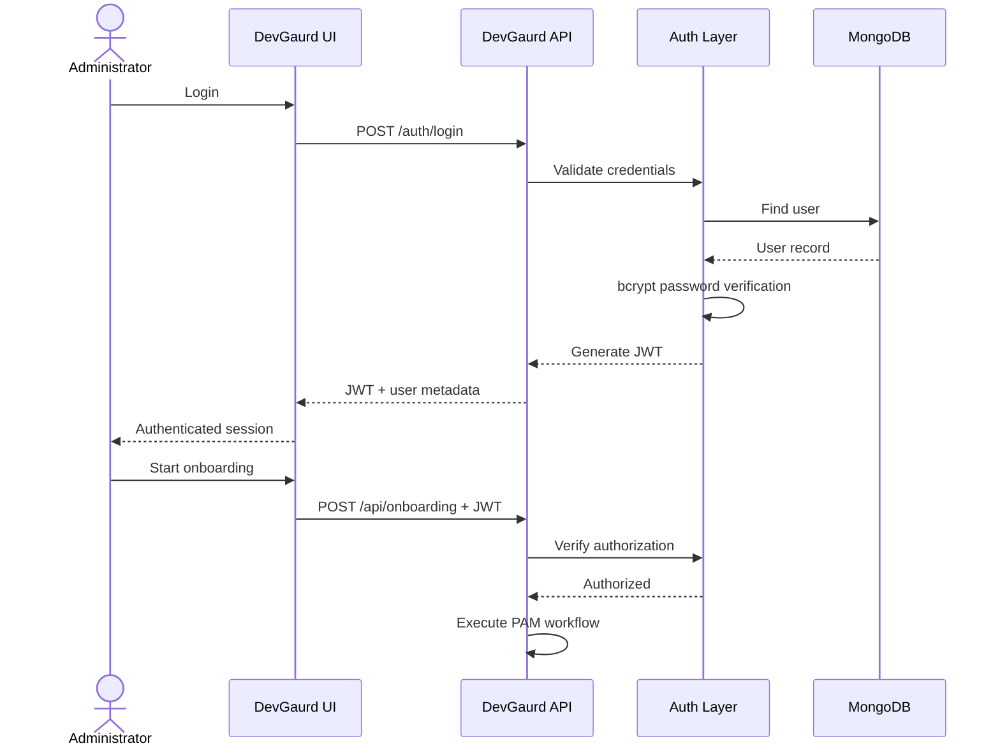

Protected onboarding operations require authorization middleware before the workflow can execute.

---

# 📊 Auditability & Observability

Each onboarding workflow generates an audit record.

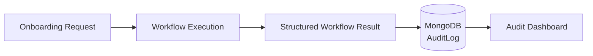

Tracked workflow information includes:

- Workflow type
- Request payload
- Request ID
- Request timestamp
- Completion timestamp
- Execution duration
- Individual provisioning results
- Workflow success/failure state

The audit dashboard also calculates operational KPIs:

```text
Total Requests
       │
       ├── Successful Requests
       │
       ├── Failed Requests
       │
       └── Average Execution Time
```

---

# 📊 Workflow Response

A successful onboarding request returns structured execution information.

```json
{
  "success": true,
  "message": "User onboarded successfully",
  "requestId": "e19a39be-f519-4884-b582-890c5fc641bc",
  "requestedAt": "2026-07-31T11:35:54.562Z",
  "completedAt": "2026-07-31T11:36:00.291Z",
  "durationMs": 5729,
  "steps": {
    "user": {
      "status": "already_exists",
      "userId": 203,
      "username": "user@cyberark.cloud",
      "userType": "EPVUser"
    },
    "groupMemberships": [
      {
        "status": "already_member",
        "groupId": 70,
        "groupName": "Privilege Cloud Users"
      }
    ],
    "safe": {
      "status": "already_exists",
      "safeId": 89,
      "safeName": "user_safe"
    },
    "safeMembership": {
      "status": "already_added",
      "safeName": "user_safe"
    },
    "account": {
      "status": "already_exists",
      "accountId": "89_3",
      "userName": "SVC_PAM_PROD",
      "platformId": "kpmgtest_domainaccounts",
      "address": "dc01.prod.local"
    }
  }
}
```

The response is intentionally **step-oriented** so the frontend can visualize provisioning progress and provide actionable operational information.

Possible statuses include:

```text
created
already_exists
assigned
already_member
added
already_added
completed
```

---

# 🛠️ Tech Stack

## Frontend

| Technology     | Usage                      |
| -------------- | -------------------------- |
| **React**      | User interface             |
| **TypeScript** | Static typing              |
| **Vite**       | Frontend tooling and build |
| **CSS**        | Application styling        |
| **Axios**      | Backend API communication  |

## Backend

| Technology     | Usage                         |
| -------------- | ----------------------------- |
| **Node.js**    | Server runtime                |
| **Express.js** | REST API framework            |
| **Axios**      | CyberArk API integration      |
| **JWT**        | Authentication                |
| **bcrypt**     | Password hashing              |
| **CORS**       | Cross-origin request handling |

## Data & PAM

| Technology             | Usage                             |
| ---------------------- | --------------------------------- |
| **MongoDB**            | Application and audit persistence |
| **Mongoose**           | MongoDB ODM                       |
| **CyberArk PAM**       | Privileged Access Management      |
| **CyberArk REST APIs** | Automated PAM provisioning        |

---

# 🌐 API

## Authentication

### Signup

```http
POST /auth/signup
Content-Type: application/json
```

```json
{
  "username": "admin",
  "password": "********"
}
```

### Login

```http
POST /auth/login
Content-Type: application/json
```

```json
{
  "username": "admin",
  "password": "********"
}
```

---

## Health

```http
GET /api/health
```

---

## User Onboarding

```http
POST /api/onboarding
Authorization: Bearer <JWT>
Content-Type: application/json
```

Example request:

```json
{
  "username": "user@cyberark.cloud",
  "email": "user@example.com",
  "firstName": "Soham",
  "lastName": "Khanna",
  "account": {
    "username": "SVC_PAM_PROD",
    "platformId": "kpmgtest_domainaccounts",
    "address": "dc01.prod.local"
  }
}
```

---

## Audit Logs

```http
GET /api/audit-logs
Authorization: Bearer <JWT>
```

Returns workflow history and operational KPIs.

---

# 📁 Repository Structure

```text
DevGaurd/
│
├── backend/
│   ├── app.js
│   │
│   ├── auth/
│   │   └── jwt.js
│   │
│   ├── controllers/
│   │   ├── audit.controller.js
│   │   ├── auth.login.controller.js
│   │   ├── auth.signup.controller.js
│   │   ├── health.controller.js
│   │   └── onboarding.controller.js
│   │
│   ├── middlewares/
│   │   └── adminOnly.js
│   │
│   ├── models/
│   │   ├── AuditLog.js
│   │   └── User.js
│   │
│   ├── routes/
│   │   ├── api.routes.js
│   │   └── auth.routes.js
│   │
│   ├── services/
│   │   └── onboarding.service.js
│   │
│   ├── utils/
│   ├── package.json
│   └── .env
│
├── frontend/
│   ├── src/
│   │   ├── api/
│   │   ├── assets/
│   │   ├── components/
│   │   ├── context/
│   │   ├── layouts/
│   │   ├── pages/
│   │   ├── types/
│   │   ├── utils/
│   │   ├── App.tsx
│   │   ├── main.tsx
│   │   └── index.css
│   │
│   ├── package.json
│   ├── vite.config.ts
│   └── tsconfig.json
│
├── images/
│   ├── dashboard.png
│   ├── user-onboarding.png
│   ├── workflow-result.png
│   └── audit-logs.png
│
├── .gitignore
└── README.md
```

---

# ⚙️ Environment Variables

Create:

```text
backend/.env
```

Example:

```env
PORT=4444

MONGODB_URI=<mongodb-connection-string>

JWT_SECRET=<strong-random-secret>

CYBERARK_BASE_URL=<cyberark-base-url>
CYBERARK_TOKEN_URL=<cyberark-token-url>
CYBERARK_CLIENT_ID=<cyberark-client-id>
CYBERARK_CLIENT_SECRET=<cyberark-client-secret>
```

Configure the frontend API base URL according to the deployment environment.

### Important

Never commit actual credentials to source control.

A production repository should provide:

```text
.env.example
```

containing placeholders rather than secrets.

---

# 🚀 Getting Started

## Prerequisites

- Node.js 20+
- npm
- MongoDB
- CyberArk PAM / Privilege Cloud environment
- CyberArk API client credentials

---

## 1. Clone the repository

```bash
git clone https://github.com/sohamkhanna08/DevGaurd.git
cd DevGaurd
```

---

## 2. Start the Backend

```bash
cd backend
npm install
```

Configure:

```text
backend/.env
```

Start the server:

```bash
npm start
```

Development:

```bash
npm run dev
```

Default API:

```text
http://localhost:4444
```

---

## 3. Start the Frontend

```bash
cd frontend
npm install
npm run dev
```

Vite will provide the local frontend URL.

---

# 🔒 Security Considerations

DevGaurd automates privileged operations and should therefore be treated as a security-sensitive application.

Before production deployment, the following controls should be implemented or strengthened:

- Use HTTPS/TLS.
- Never expose CyberArk credentials to the browser.
- Never commit `.env` files containing secrets.
- Store secrets in a centralized secrets manager.
- Use least-privileged CyberArk API identities.
- Rotate CyberArk credentials regularly.
- Protect JWT signing secrets.
- Enforce authorization on every privileged endpoint.
- Validate and sanitize incoming request data.
- Avoid logging passwords, tokens or secrets.
- Do not use static/default passwords for managed accounts.
- Protect audit records from unauthorized modification.
- Implement centralized security monitoring.
- Perform dependency and vulnerability scanning.
- Conduct security testing before production deployment.
- Implement rate limiting on authentication endpoints.
- Add request-level idempotency keys for production workflows.
- Add concurrency protection around check-before-create operations.

---

# 🔄 Failure & Recovery Model

The workflow is designed to be retry-friendly.

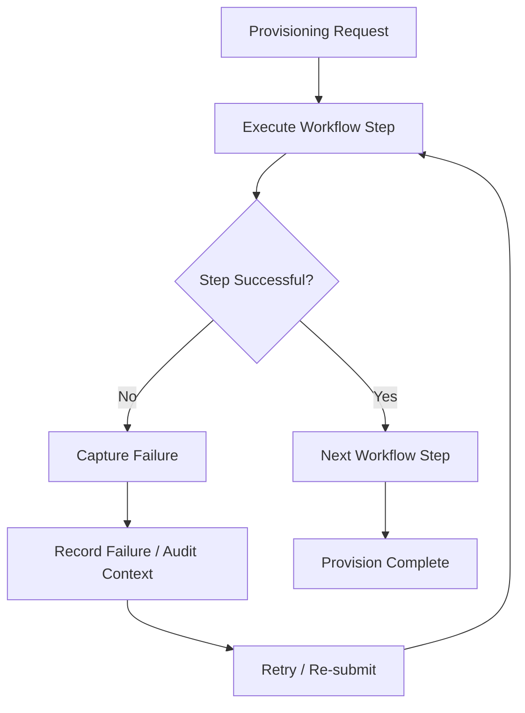

Because individual resources are checked before creation, a partially completed workflow can be re-submitted and continue toward the desired CyberArk state.

For stronger enterprise recovery, future versions can introduce:

- Durable workflow state
- Workflow checkpoints
- Queue-based execution
- Automatic retry policies
- Dead-letter handling
- Request-level idempotency keys
- Distributed locking
- Resume-from-failure capabilities

---

# 🧪 Testing Strategy

A production implementation should validate the system at multiple levels.

## Unit Testing

Individual CyberArk service operations should be tested independently:

```text
checkUserExists()
createUser()
ensureGroupMembership()
checkSafeExists()
createSafe()
isUserMemberOfSafe()
addUserToSafe()
checkAccountExists()
createAccount()
reconcileAccount()
```

---

## Integration Testing

Validate the complete interaction between:

```text
DevGaurd API
     │
     ├── MongoDB
     │
     └── CyberArk Test Environment
```

---

## Idempotency Testing

Execute the same request multiple times:

```text
Request #1 → Resources CREATED

Request #2 → Resources ALREADY EXISTS

Request #3 → Resources ALREADY EXISTS
```

Expected behavior:

```text
No unintended duplicate CyberArk resources.
```

---

# 🧩 Key Components

### Backend

| Component                   | Purpose                                                           |
| --------------------------- | ----------------------------------------------------------------- |
| `onboarding.service.js`     | Core PAM provisioning orchestration and idempotent workflow logic |
| `onboarding.controller.js`  | Handles onboarding API requests and responses                     |
| `adminOnly.js`              | Authorization middleware protecting privileged PAM operations     |
| `jwt.js`                    | JWT creation and authentication utilities                         |
| `auth.login.controller.js`  | User authentication and credential verification                   |
| `auth.signup.controller.js` | Application user registration                                     |
| `User.js`                   | MongoDB application-user model                                    |
| `AuditLog.js`               | Persists provisioning workflow execution history                  |
| `audit.controller.js`       | Retrieves audit history and workflow KPIs                         |

### Frontend

| Component                        | Purpose                                                                                                     |
| -------------------------------- | ----------------------------------------------------------------------------------------------------------- |
| `AuthContext.tsx`                | Global authentication state, logged-in user information, JWT/session handling, and authentication lifecycle |
| `SidebarContext.tsx`             | Global sidebar state including collapse, expansion, and responsive/mobile navigation behavior               |
| `cyberarkApi.ts`                 | Frontend API service for communicating with the DevGaurd backend                                            |
| `ProvisioningProgressWidget.tsx` | Visualizes individual PAM provisioning steps and their execution status                                     |
| `WorkflowSuccessCard.tsx`        | Displays completed provisioning results and workflow summary                                                |
| `RequestDrawer.tsx`              | Displays detailed onboarding request and execution information                                              |
| `AuditLogsPage.tsx`              | Provides audit history, execution metrics, and operational visibility                                       |
| `UserOnboardingPage.tsx`         | Provides the interface for submitting PAM onboarding requests                                               |
| `DashboardPage.tsx`              | Provides high-level operational KPIs and recent workflow activity                                           |
| `DataTable.tsx`                  | Reusable tabular data presentation component                                                                |
| `StepCard.tsx`                   | Reusable component for displaying individual workflow steps                                                 |
| `StatusBadge.tsx`                | Displays standardized provisioning states such as `created`, `already_exists`, and `failed`                 |
| `LoadingOverlay.tsx`             | Provides consistent loading feedback during asynchronous operations                                         |
| `ErrorBanner.tsx`                | Displays actionable API and workflow errors                                                                 |
| `MainLayout.tsx`                 | Application shell containing navigation and page layout                                                     |
| `Sidebar.tsx`                    | Primary application navigation and PAM portal navigation                                                    |
| `TopNavbar.tsx`                  | Global application header and user/navigation controls                                                      |

### Architecture & State Management

DevGaurd uses React Context to maintain application-wide state without tightly coupling individual pages and components.

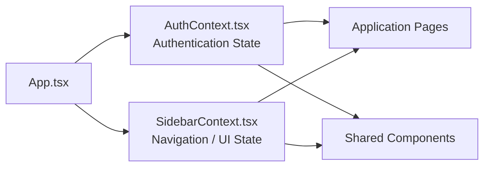

---

# 🎯 Key Benefits

| Capability                   | Benefit                                                  |
| ---------------------------- | -------------------------------------------------------- |
| **PAM Automation**           | Reduces repetitive privileged-access administration      |
| **State-Aware Provisioning** | Uses existing CyberArk state before performing mutations |
| **Retry-Friendly Workflow**  | Repeated requests converge toward the desired state      |
| **Centralized Workflow**     | Provides one interface for multi-step onboarding         |
| **Auditability**             | Maintains workflow execution history                     |
| **Observability**            | Provides request IDs, timestamps and execution metrics   |
| **Authorization**            | Restricts privileged workflow operations                 |
| **API-Driven**               | Integrates directly with CyberArk APIs                   |
| **Extensible Architecture**  | Provides a foundation for enterprise integrations        |

---

# 📈 Enterprise Evolution

DevGaurd provides a foundation that can be extended into a larger enterprise PAM automation platform.

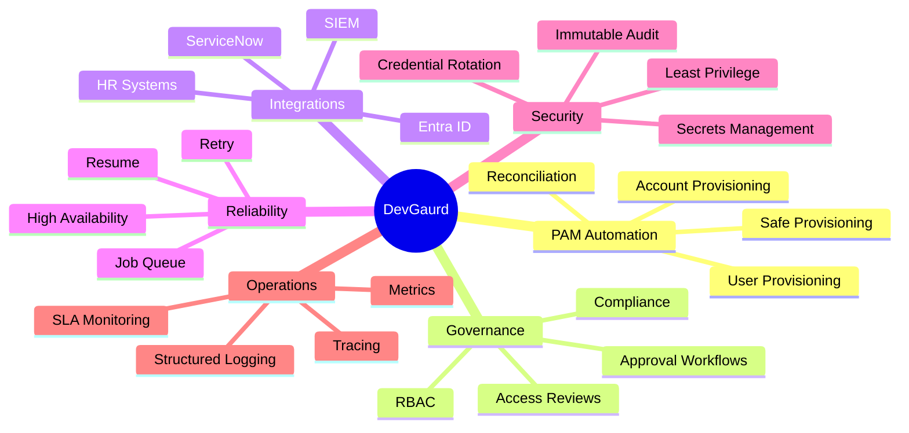

Potential enterprise integrations include:

```text
                    DevGaurd
                       │
       ┌───────────────┼────────────────┐
       │               │                │
       ▼               ▼                ▼
   CyberArk       ServiceNow       Entra ID
       │               │                │
       └───────────────┼────────────────┘
                       │
                       ▼
                 Audit / SIEM
```

---

# 🛣️ Roadmap

- Workflow resume after failure
- Enterprise RBAC
- Multi-level approval workflow
- ServiceNow integration
- Microsoft Entra ID integration
- Automated offboarding
- Access review workflows
- Structured application logging
- Distributed tracing
- Centralized secrets management
- SIEM integration
- Automated integration testing
- High-availability deployment
- Queue-based asynchronous provisioning
- Kubernetes deployment

---

# 💼 Project Context

**DevGaurd was developed during my Summer Internship as a Software Development Engineer (SDE) Intern at KPMG, as part of the DT Cyber Transformation team.**

The project was developed as an engineering-focused solution around **Privileged Access Management automation**, with emphasis on:

- CyberArk PAM integration
- REST API automation
- Backend workflow orchestration
- Idempotent provisioning
- Authentication and authorization
- Auditability
- Operational visibility
- Full-stack application development

The project demonstrates how repetitive PAM administration workflows can be transformed into a centralized, API-driven and observable application.

# 👨‍💻 Author

## Soham Khanna

**Software Development Engineer Intern | Full-Stack Developer**

I developed **DevGaurd — PAM Automation Portal** during my Summer Internship at KPMG as part of the **DT Cyber Transformation team**, focusing on full-stack development, CyberArk API integration, PAM workflow automation, backend orchestration and auditability.

<p align="left">
  <a href="https://github.com/sohamkhanna08">
    
  </a>
  <a href="https://www.linkedin.com/in/sohamkhanna">
    
  </a>
</p>

---

# 📜 License & Usage

Copyright © 2026 Soham Khanna. All rights reserved.

DevGaurd is maintained as a portfolio and educational project by **Soham Khanna**.

This repository is publicly available for viewing and educational/reference purposes. No permission is granted to copy, modify, redistribute, sublicense, or use the project or substantial portions of its source code for commercial or derivative purposes without prior written permission from the author.

For permission regarding reuse, modification, distribution, or commercial use, please contact the author.

> **Note:** CyberArk, KPMG, and their respective trademarks, logos, and product names are the property of their respective owners. This project does not claim ownership of those trademarks or affiliated intellectual property.

---

# ⭐ Project Summary

DevGaurd demonstrates how enterprise PAM onboarding can move from a repetitive manual process to an automated workflow:

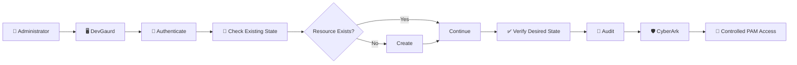

**DevGaurd — PAM Automation Portal**

> **Automate. Verify. Audit. Secure.**

<p align="center">

**PAM Automation • CyberArk • Idempotency • Security • Auditability • Full-Stack Engineering**

</p>
